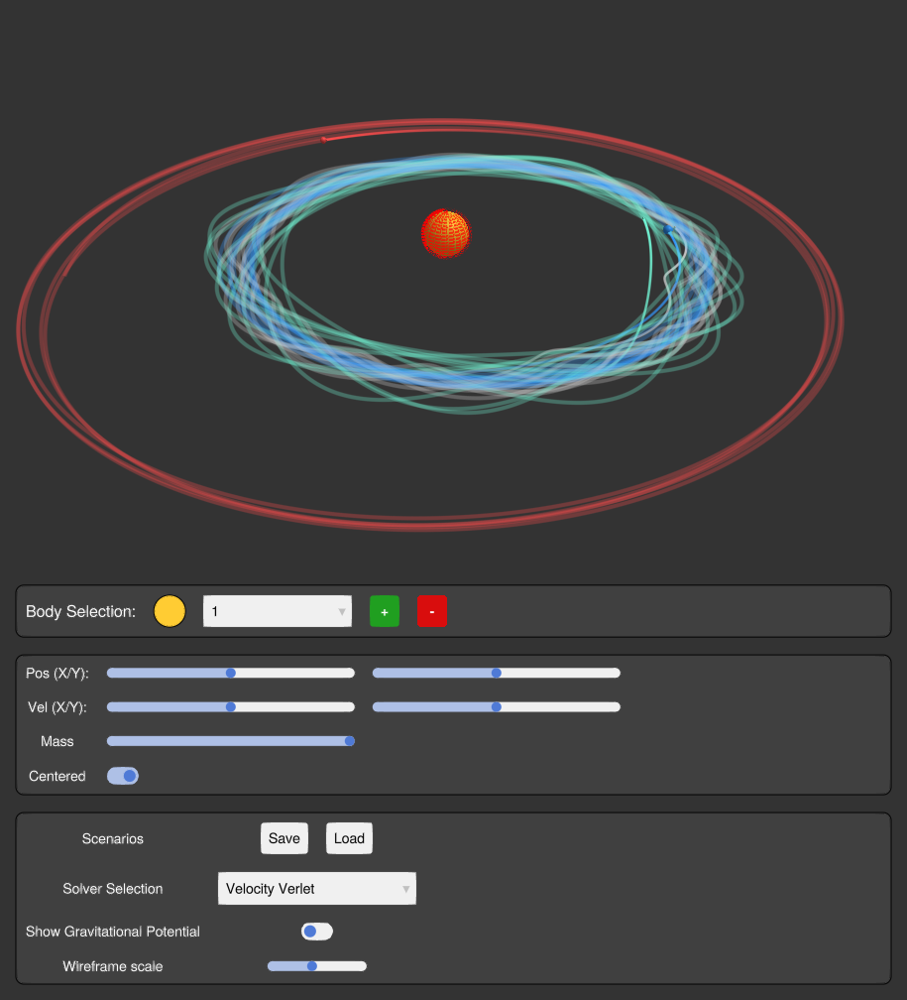

# *OrbiJul* -- Project_becvama3

Interactive N-body sim with custom UI environment made in Makie (**GLMakie**
used). Testing multiple different solvers for the physics calculations.

Allows the user to build a custom N-body environments, save and load it. 
Contains prepared examples.



## Running the Project

Clone the project folder from Github. Navigate to the folder and run:
```bash
julia --project -e "using OrbiJul; main()"
```

## Application Controls

| Input | Action |
| --- | --- |
| **Space** | Pause / Play Simulation |
| **Delete** | Reset Simulation |
| **W/S/A/D** | Translate Camera |
| **Q/R** | Rotate Camera (around own axis) |
| **Left Click + Drag** | Rotate Camera (around center) |
| **Right Click + Drag** | Pan Camera |
| **Scroll Wheel** | Zoom In / Out |
| **UI Menus** | Select bodies, adjust parameters, change solvers, and load/save scenarios |

### UI Guide

* **Scenario File:** Load preset systems (Solar System, Figure-8) or save your own custom creations from JSON files.
* **Body Selection:** Add new bodies or select existing ones to modify their mass, position, and velocity in real-time.
* **Simulation Inspector:** Switch between **Euler** (fast, imprecise), **Verlet** (stable orbits), and **RK4** (high precision) solvers on the fly.
* **Gravitational Potential:** Toggle the 3D wireframe to visualize the "gravity well" curvature.

## Failing Test Disclaimer
The *Aqua* testing module takes quite a while to run. One of the reasons is the
size of GLMakie library. Secondly, the app GUI is running in an infinite loop,
which is something that *Aqua* fails on `Persistent tasks` test.
